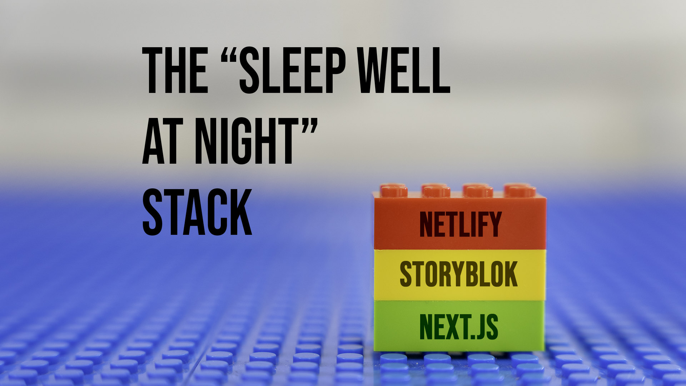

## 👋 Hi, I’m Jason!  
👨‍🎓 Graduate of the Full-Stack [NuCamp Bootcamp](https://nucamp.co)  
💻 Software Developer currently Open for Work [LinkedIn](https://www.linkedin.com/in/jasonkylesmith/)

- React, Next.js, CSS, TailwindCSS, Node.js/Express, AWS (Amplify, Cognito, S3, ElasticBeanstalk), Netlify, Storyblok, React Native, Expo

### Current Public Projects
:iphone: [Wayfarer's Gauntley](https://github.com/jasonkylesmith/wayfarers-gauntlet) - A React Native application based off the Scoundrel card game

### LinkedIn Articles

  

<!---
Structure for Clickable Images

  
  &nbsp; &nbsp; &nbsp;
  
  &nbsp; &nbsp; &nbsp;
  
   
   
  
  

--->

<!---
https://www.linkedin.com/pulse/sleep-well-night-stack-my-recommended-alternative-wordpress-smith-skrbc
### 🔥 Check out what I'm working on!  
* A new JasonKyleSmith.com website using Gatsby, Contentful, and Netlify ([On GitHub](https://github.com/jasonkylesmith/jasonkylesmith.com) - [Preview](http://preview.jasonkylesmith.com))
* The Very Nerdy Clothing Company Website ([On GitHub](https://github.com/jasonkylesmith/verynerdy-product-website-v2) - [DEMO](https://jasonkylesmith.github.io/verynerdy-product-website-v2/) - [NuCamp Honors Submission Video](https://youtu.be/C9fxidJQpSw))
* Record Commander - A Python project that edits a local text file via UI, to be used with Streamlabs in order to update a text field while streaming ([On GitHub](https://github.com/jasonkylesmith/RecordCommander))
--->

<!---
jasonkylesmith/jasonkylesmith is a ✨ special ✨ repository because its `README.md` (this file) appears on your GitHub profile.
You can click the Preview link to take a look at your changes.
--->
